# Adaptive ROI MobileNetV2 Training Pipeline

This project trains and exports a lightweight MobileNetV2 image classifier for adaptive ROI-driven mobile vision inference. It uses COCO `train2017` object annotations to crop clean object regions, trains MobileNetV2 on those ROI crops, applies pruning and TFLite quantization, and produces Android-ready model assets.

The pipeline is based on the paper idea:

```text
Adaptive ROI-Driven Inference for Low-Latency and Energy-Efficient Mobile Vision Systems
```

## Overview

Instead of training on full images, the script crops annotated object bounding boxes from COCO. These crops simulate the region-of-interest inputs that a mobile app would classify at runtime after object or ROI detection.

The model classifies eight COCO object classes:

- person
- bicycle
- car
- cat
- dog
- bottle
- cell phone
- backpack

The final output is a compact TensorFlow Lite model that can be placed in an Android app's assets folder.

## Pipeline

```mermaid
flowchart LR
    A[COCO train2017 Images] --> B[Load COCO Annotations]
    B --> C[Filter Target Classes]
    C --> D[Crop Bounding Boxes]
    D --> E[Create Train/Val/Test Split]
    E --> F[Train MobileNetV2 Head]
    F --> G[Fine-Tune Top Layers]
    G --> H[Test Evaluation]
    H --> I[50 Percent Dense-Layer Pruning]
    I --> J[TFLite Quantization]
    J --> K[Android Assets]
```



## Dataset

The script downloads COCO `train2017` directly from the official COCO servers.

Dataset details:

- Image set: COCO `train2017`
- Images: 118,287
- Target classes: 8
- Crops per class: 500
- Total ROI images: 4,000
- Input size: 224 x 224 RGB
- Split: 70 percent train, 15 percent validation, 15 percent test

The script filters out very small bounding boxes before cropping:

- Minimum bounding-box side length: 40 pixels
- Minimum bounding-box area: 1,600 pixels
- Padding around bounding box: 10 percent

## Requirements

The notebook/script is intended to run in Google Colab with GPU enabled.

Recommended runtime:

- Google Colab
- GPU runtime, preferably T4
- TensorFlow 2.15.0 for the main setup
- Enough disk space for the COCO download, roughly 18 GB for images plus annotations

Python packages used:

```text
tensorflow
tensorflow-model-optimization
matplotlib
seaborn
scikit-learn
tqdm
Pillow
opencv-python-headless
```

## How to Run

Open the notebook or Colab-exported Python file in Google Colab, then run the cells in order.

Before running:

1. Select `Runtime > Change runtime type`.
2. Set hardware accelerator to `GPU`.
3. Run the dependency installation cells.
4. Run the COCO download and extraction cells.
5. Continue through training, evaluation, pruning, quantization, and download.

The COCO download step is large and may take 10 to 20 minutes depending on Colab speed.
