# Adaptive ROI MobileNetV2 Training Pipeline

This project trains and exports a lightweight MobileNetV2 image classifier for adaptive ROI-driven mobile vision inference. It uses COCO `train2017` object annotations to crop clean object regions, trains MobileNetV2 on those ROI crops, applies pruning and TFLite quantization, and produces Android-ready model assets.

The pipeline is based on the paper idea:

```text
Adaptive ROI-Driven Inference for Low-Latency and Energy-Efficient Mobile Vision Systems
```

## Overview

Instead of training on full images, the script crops annotated object bounding boxes from COCO. These crops simulate the region-of-interest inputs that a mobile app would classify at runtime after object or ROI detection.

The model classifies eight COCO object classes:

- person
- bicycle
- car
- cat
- dog
- bottle
- cell phone
- backpack

The final output is a compact TensorFlow Lite model that can be placed in an Android app's assets folder.

## Pipeline

```mermaid
flowchart LR
    A[COCO train2017 Images] --> B[Load COCO Annotations]
    B --> C[Filter Target Classes]
    C --> D[Crop Bounding Boxes]
    D --> E[Create Train/Val/Test Split]
    E --> F[Train MobileNetV2 Head]
    F --> G[Fine-Tune Top Layers]
    G --> H[Test Evaluation]
    H --> I[50 Percent Dense-Layer Pruning]
    I --> J[TFLite Quantization]
    J --> K[Android Assets]
```



## Dataset

The script downloads COCO `train2017` directly from the official COCO servers.

Dataset details:

- Image set: COCO `train2017`
- Images: 118,287
- Target classes: 8
- Crops per class: 500
- Total ROI images: 4,000
- Input size: 224 x 224 RGB
- Split: 70 percent train, 15 percent validation, 15 percent test

The script filters out very small bounding boxes before cropping:

- Minimum bounding-box side length: 40 pixels
- Minimum bounding-box area: 1,600 pixels
- Padding around bounding box: 10 percent

## Requirements

The notebook/script is intended to run in Google Colab with GPU enabled.

Recommended runtime:

- Google Colab
- GPU runtime, preferably T4
- TensorFlow 2.15.0 for the main setup
- Enough disk space for the COCO download, roughly 18 GB for images plus annotations

Python packages used:

```text
tensorflow
tensorflow-model-optimization
matplotlib
seaborn
scikit-learn
tqdm
Pillow
opencv-python-headless
```

## How to Run

Open the notebook or Colab-exported Python file in Google Colab, then run the cells in order.

Before running:

1. Select `Runtime > Change runtime type`.
2. Set hardware accelerator to `GPU`.
3. Run the dependency installation cells.
4. Run the COCO download and extraction cells.
5. Continue through training, evaluation, pruning, quantization, and download.

The COCO download step is large and may take 10 to 20 minutes depending on Colab speed.

## Model Architecture

The classifier uses MobileNetV2 as a pretrained visual backbone.

Training flow:

- Load MobileNetV2 with ImageNet weights.
- Remove the original classification head.
- Add global average pooling.
- Add batch normalization.
- Add dense layers with ReLU activation and L2 regularization.
- Add dropout for overfitting control.
- Add a softmax output layer for the eight target classes.

The model is trained in two phases:

- Phase 1: freeze MobileNetV2 and train only the custom classification head.
- Phase 2: unfreeze and fine-tune the top 30 MobileNetV2 layers.

## Data Augmentation

The training generator applies augmentations to improve robustness under mobile-camera conditions:

- Rotation
- Zoom
- Horizontal flip
- Brightness variation
- Width and height shift
- Shear

Images are preprocessed using `tf.keras.applications.mobilenet_v2.preprocess_input`, which scales RGB values from `[0, 255]` to `[-1, 1]`.

## Evaluation

The script evaluates the trained model on the held-out test split and generates:

- Test accuracy
- Top-3 accuracy
- Classification report
- Confusion matrix
- Training curves for accuracy, loss, and top-3 accuracy

Generated visual outputs include:

```text
/content/sample_crops.png
/content/training_curves.png
/content/confusion_matrix.png
```

## Pruning and Quantization

After training, the script applies manual magnitude pruning to Dense layers with a target sparsity of 50 percent. The pruned model is fine-tuned briefly to recover accuracy.

The script then exports:

- Hybrid TFLite model with INT8 weights and FP32 activations
- Optional full INT8 TFLite model

It also benchmarks TFLite inference accuracy and latency using the test generator.

## Output Files

Main files produced by the pipeline:

```text
/content/best_phase1.keras
/content/best_model.keras
/content/model_pruned.keras
/content/model.tflite
/content/model_int8.tflite
/content/labels.txt
```

Android assets:

```text
app/src/main/assets/model.tflite
app/src/main/assets/labels.txt
```

The class order is written to `labels.txt` and should always be used instead of hardcoding labels.

Expected label order:

```text
backpack
bicycle
bottle
car
cat
cell_phone
dog
person
```

## Android Integration Notes

The Android app should preprocess each ROI exactly like MobileNetV2:

```text
pixel_float = pixel / 127.5 - 1.0
```

Expected model input:

```text
shape: 1 x 224 x 224 x 3
type: float32
```

Expected model output:

```text
shape: 1 x 8
type: float32
```

At runtime, the app should:

1. Crop or receive an ROI bitmap.
2. Resize it to 224 x 224.
3. Normalize RGB channels to `[-1, 1]`.
4. Run TFLite inference.
5. Select the label with the highest confidence.
6. Optionally draw or log the prediction only when confidence exceeds a threshold, such as `0.60`.

## Limitations

- The script is written as a Colab workflow and includes notebook shell commands such as `!pip`, `!wget`, and `!unzip`.
- The COCO download is large and is not suitable for quick local runs.
- The classifier is trained only on cropped object ROIs, not full scenes.
- Performance depends on the quality of ROI extraction during Android inference.
- Manual Dense-layer pruning reduces classifier weights but does not fully restructure convolution layers.

## Future Improvements

- Convert the Colab workflow into a reusable Python CLI.
- Add argument support for custom classes, crop counts, and output paths.
- Add reproducible experiment logging.
- Evaluate on real mobile-camera ROI crops.
- Add TensorFlow Lite delegate benchmarks for CPU, GPU, and NNAPI.
- Try structured convolution pruning for stronger runtime gains.
- Add end-to-end Android demo inference code.

